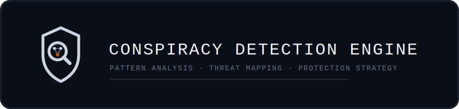

  

# 🕵️ Conspiracy Detection Engine (V2 — Large Scale)

An AI-powered, multi-page conspiracy detection and personal safety intelligence platform built with React and Claude AI.

---

## 🧩 Application Architecture

### Pages & Navigation
- **Dashboard** — Threat distribution stats, recent cases, avg threat score, case count by status
- **All Cases** — Searchable, filterable case grid with threat badges and quick stats
- **New Case Wizard** — 10-step guided intake form
- **Case Detail** — Full 9-tab investigation workspace per case

### 10-Step Case Intake Wizard
1. Personal Identity (name, age, religion, caste, location)
2. Education History (schools, colleges, achievements)
3. Professional History (companies, roles, career progression)
4. Goals & Aspirations (future plans — primary conspiracy trigger)
5. Information Shared (who knows what — critical leakage map)
6. Organizational Power Structure (family-controlled, cross-border links)
7. Behavioral Signals (colleague, HR, management changes)
8. Incidents & Events (with dates, false narratives, exclusions)
9. External Factors (police, legal threats, immigration, government)
10. Review & Launch Analysis

### 9-Tab Case Investigation Workspace
| Tab | Contents |
|-----|----------|
| Overview | Executive summary, key insight, risk factors, info leakage map, red flags, cross-border dynamics, legal exposure |
| Timeline | Chronological conspiracy event sequence with actors |
| Actors | Full actor profiles with involvement level, danger level, psychological drivers |
| Network Map | Interactive SVG actor relationship graph (hover for details) |
| Patterns | Detected conspiracy pattern cards with severity ratings |
| Deep Dive | 6 AI-powered focused analysis modules (psychological, legal, digital, immigration, recovery, institutional) |
| Evidence Vault | Log, categorize, filter evidence items (email, document, witness, recording, etc.) |
| Protection | Auto-generated 8-category protection checklist with progress tracker |
| Report | Formatted intelligence report — copy to clipboard or print |

---

## 🔍 AI Analysis Output

Each case produces:
- **Threat Level**: LOW / MEDIUM / HIGH / CRITICAL
- **Threat Score**: 0–100
- **Survivability Score**: 0–100
- **Risk Factors** with severity
- **Conspiracy Timeline** with actors per event
- **Conspirators Map** with involvement level + danger level + psychological drivers
- **Detected Patterns** (Career Suppression, Reputation Destruction, Immigration Theft, Authority Corruption, Psychological Warfare)
- **Root Cause Analysis** with category (Psychological / Systemic / Cultural / Economic)
- **Information Leakage Map** (what was shared → with whom → consequence)
- **Organizational Red Flags**
- **Cross-Border Dynamics** (India–USA corporate structures, GC angles)
- **Legal Exposure** analysis
- **8-Category Protection Plan** (Immediate, Short-Term, Long-Term, Legal, Digital, Reputation, Psychological, Immigration)
- **Warning Signs to Watch**
- **Survivability Factors**

---

## 💾 Persistent Storage

All cases persist across sessions using the Claude artifact storage API (`window.storage`). Evidence logs and protection checklist progress are saved per case.

---

## 🛠 Tech Stack

- React (JSX) with hooks
- Anthropic Claude API (`claude-sonnet-4-20250514`)
- SVG Actor Network Graph (custom, no libraries)
- Claude Artifact Storage API for persistence
- Zero external CSS or UI libraries

---

## ⚠️ Disclaimer

This tool is intended for informational and awareness purposes only. It does not constitute legal advice. If you believe you are in danger, contact appropriate authorities.

---
